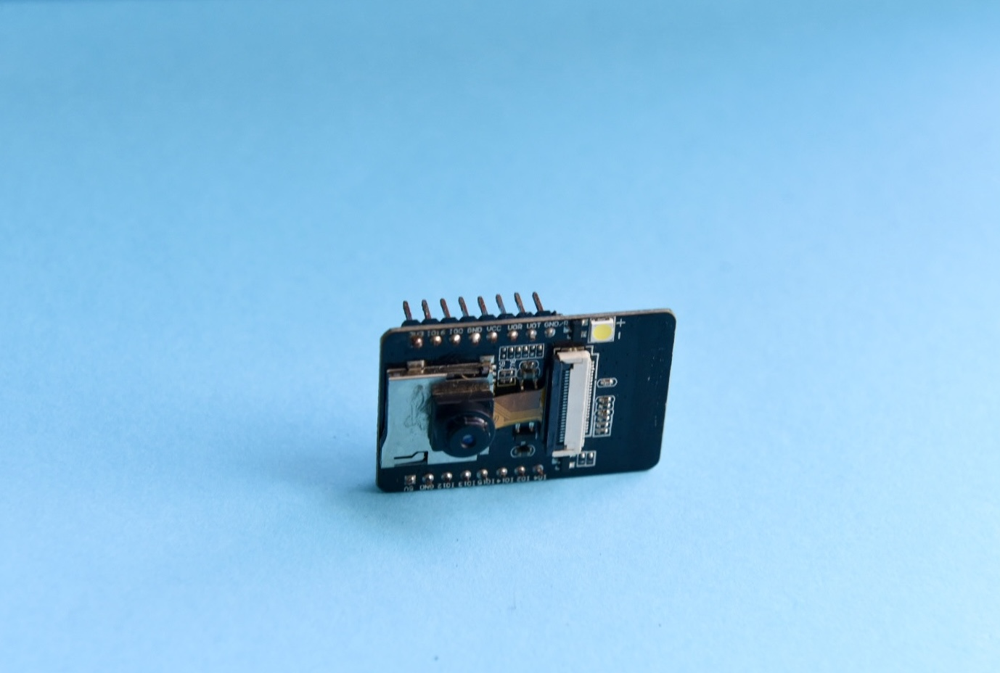

# Underwater Fishing Camera

## Introduction

As a shore angler, I've spent countless hours casting my line, waiting for bites that never came. The frustrating reality? I often had no idea if there were even any fish where I was casting. It didn't matter how good my lure was or how expensive my bait – if the fish weren't there, I wasn't catching anything.

Unlike anglers with boats who can afford expensive sonar fishfinders, I needed a budget-friendly solution that would work from the shore. That's when the idea hit me: why not create a small underwater camera that I could attach to my fishing line? This way, I could scout locations before wasting time fishing in empty water.

## Photos

  
  
  

## Why ESP32-CAM?

The ESP32-CAM module was the perfect choice for this project. Its compact size makes it ideal for attaching to a fishing line without adding too much weight or bulk that would interfere with casting. The module is also incredibly easy to program, with built-in WiFi capabilities that allow real-time video streaming directly to my phone.

Compared to other camera solutions, the ESP32-CAM offered the best balance of:
- **Size**: Small enough to attach to fishing gear
- **Cost**: Affordable for a DIY project
- **Functionality**: Built-in camera and WiFi in one module
- **Ease of use**: Well-documented and beginner-friendly

  
  

### Key Features
- Automatic recording triggered by water submersion
- Waterproof housing rated for freshwater fishing depths
- External power button (no need to open case)
- Removable battery compartment for quick swaps
- Compact design attachable to fishing line

## Design Challenges & Solutions

Building this underwater camera presented three major challenges that required creative engineering solutions:

### Challenge 1: Power Supply

The ESP32-CAM requires a stable 5-volt power supply, but standard batteries don't provide this exact voltage. I needed a compact, affordable power solution that could fit inside a waterproof housing.

**Solution: Custom PCB with Voltage Regulation**

I taught myself KiCAD and designed a custom printed circuit board to solve this problem. The PCB design included:
- A socket for a standard 9V battery (the most cost-effective option)
- An integrated voltage converter to step down from 9V to the required 5V
- A soldered outlet to securely attach the 9V battery
- Direct connection to the ESP32-CAM module

This custom board became the backbone of the entire system, efficiently powering the camera while keeping costs low.

  
  

  
  

  
### Challenge 2: Waterproof Control Interface

Opening a watertight case every time I needed to power on the camera or start recording would be impractical and risk water damage. I needed external controls that maintained the waterproof seal.

**Solution: Waterproof Button and Water-Sensing Trigger**

I used a clear PVC pipe as the main housing, cut to the appropriate length with caps on both ends. For the control interface:

**Power Button:**
- Created a groove in one end cap for a button soldered directly to the PCB
- Applied a silicon coating over the button for waterproofing
- Applied a layer of rubber on top of the button 
- Added an outer cap that compressed the rubber and with an opening that allows the button to be pressed while maintaining the seal
- This allows powering the camera on/off without opening the case

**Automatic Recording Trigger:**
- Installed a steel pin that protrudes through the case (fully waterproofed)
- Connected the pin to the ESP32-CAM's input pins via the PCB
- When submerged, water conductivity creates a small current between the pin and ground
- The ESP32 detects this current and automatically starts recording
- This eliminates the need for manual recording activation once underwater

  
  

  
  

### Challenge 3: Battery Access and Replacement

While the main housing needed to remain sealed during use, I still needed a way to easily replace the 9V battery when it ran out, without compromising the waterproof integrity of the camera compartment.

**Solution: Screw-On Battery Compartment**

On the opposite end from the control button, I designed a removable battery compartment:
- Attached a tubular screw mechanism to the main PVC pipe
- Added a separate end cap that screws onto this mechanism
- Applied waterproof sealant to the threads for a watertight seal
- Inside this compartment, I installed the wiring and soldered the 9V battery socket
- The compartment can be unscrewed for battery replacement, then securely resealed

This design allows quick battery swaps without exposing the sensitive electronics in the main camera housing.

  

## Version 1: Proof of Concept

The first version wasn't pretty, but it worked. It was proof that the idea could be made. We had a waterproof underwater camera that could be attached to a fishing line, powered by an affordable battery system, and controlled without opening the case. While the aesthetics and refinement would come later, V1 successfully demonstrated that I could scout fishing spots from shore without expensive equipment.

  

## Future Improvements

### Weight Distribution & Buoyancy
The camera doesn't balance well underwater because the heavy battery pulls it to one side, and air gets trapped unevenly in the case. Future versions will move parts around and balance the weight better so it floats straight.

### Live WiFi Video Streaming
Add live video streaming to a phone so I can see what's underwater in real-time instead of watching recorded footage later. This might need changes to how the camera is set up to get the WiFi signal working through water.

### Reverse-Facing Camera
Flip the camera around so it points backward. This way I can watch my lure as I reel it in and see how fish react to it, which helps me figure out what makes them bite.

### Size & Weight Reduction
Make the whole thing smaller and lighter by redesigning the circuit board to be more compact, switching to lighter batteries, and using a thinner case. This will make it easier to cast and attach to my fishing line.
## Contributing

If you are interested in improving the design or have suggestions, feel free to open an issue or submit a pull request!

## Contact

**Name**: Jason Zhang

**Email**: jason.zhang.duidui@gmail.com

---

*Built with passion for fishing and engineering*
